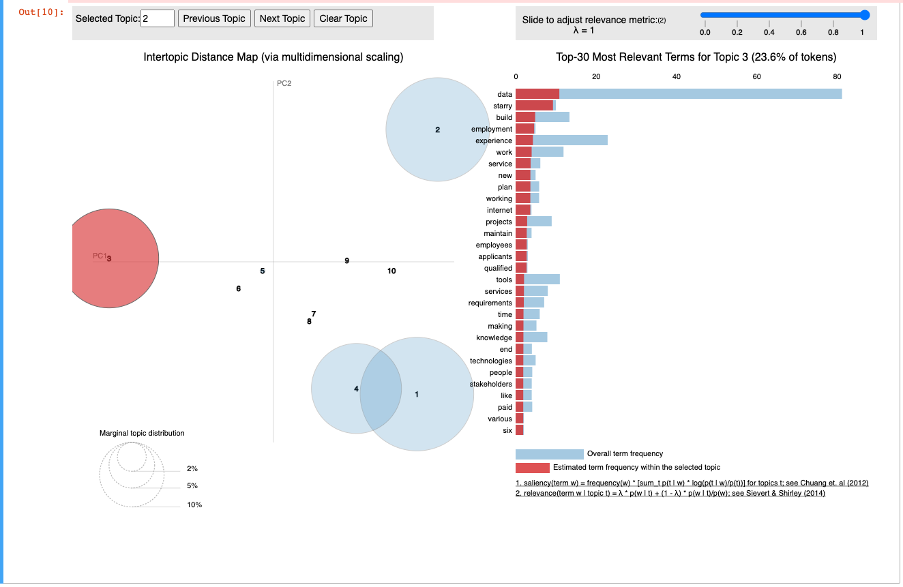

# LinkedIn_Position_Finder

## Project Overview 
The goal of this project is to 
- [x] Scrap LinkedIn job description
- [x] Save results in the Mysql database 
- [x] Apply LDA on top of the saved texts
## Result
I have scrapped ten pages of data engineering jobs on LinkedIn, and here are the results.

## Explanation
LDA brings out latent topics within text. It groups similar topics together and within each topic is a distribution of words. In my finding, there are mainly three groups. **Group 2,3, (1,4)**. 
- [x] **Group 1** focuses more on **data** and **business** sectors. 
- [x] **Group 3** focuses more on **data** and **employment**.
- [x] **group (1,4)** focuses more on **data** with **experience**. 
Overall, my LDA analysis shows that to find a job as a data engineer, applicants need to have 
- [x] Solid data background (this covers data pipeline, warehouse, etc.)
- [x] Good previous experince 
- [x] Business acumens

## What's next?
Diversity search options (automate whatever jobs that I want to find on LinkedIn)
Incorporate other NLP algorithms and compare them with the current LDA model. 
